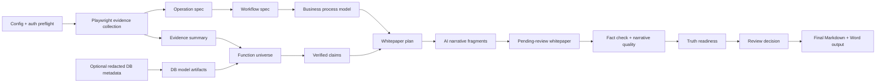

# System Whitepaper Skill

Evidence-driven Codex skill for generating high-truth system function whitepapers from test-environment UI evidence, screenshots, deterministic pipeline artifacts, optional redacted database metadata, and AI-assisted narrative writing.

The project goal is to make system whitepaper generation reproducible and reviewable:

- system truth coverage >= 95%
- whitepaper factuality >= 95%
- whitepaper quality >= 95%
- business process, purpose, and feature summaries must trace to evidence or be explicitly labeled as inferred/pending
- no manual whitepaper drafting as the normal path
- local Playwright + AI writing provider only; no Browser Use, Stagehand, or Crawlee dependency
- secrets and database credentials are script inputs only and must never enter prompts, whitepapers, or review artifacts

## What This Builds

For each configured system, the pipeline produces a bounded evidence and delivery package:

- UI evidence and screenshots
- `operation-spec.json`
- `workflow-spec.json`
- optional redacted `database-profile.json`, `data-dictionary.json`, and `entity-model.json`
- `function-universe.json`
- `verified-claims.json`
- `whitepaper-plan.json`
- `whitepaper.pending-review.md`
- `truth-readiness-report.json`
- `whitepaper.final.md` and Word output after approval

The whitepaper body may only use writable, verified claims. Weak, database-only, inferred, or unsupported claims must stay in pending confirmations or evidence-bound boundary notes.

## Architecture



## Quick Start

Install dependencies:

```powershell
npm install
```

Create local runtime folders and example config:

```powershell
npm run init
```

Edit local config and secrets under ignored paths:

- `config/systems.local.yaml`
- `secrets/`
- `secrets/db/` when redacted database metadata collection is enabled

Validate local prerequisites:

```powershell
npm run doctor
```

Run one configured system:

```powershell
npm run pipeline -- --system <system-code> --with-whitepaper
```

Run a bounded batch:

```powershell
npm run batch -- --systems <code1>,<code2> --concurrency 2
```

Open the local dashboard:

```powershell
npm run dashboard
```

## Quality Gates

Use these gates before claiming a change is ready:

```powershell
npm run test:gate:quick
npm run test:gate:core
npm run test:gate:full
```

Gate scope:

- `test:gate:quick`: regression suite plus package dry-run.
- `test:gate:core`: quick gate plus agent isolation declaration checks.
- `test:gate:full`: core gate plus truth readiness, batch acceptance, delivery readiness, and real-run readiness.

For a generated system output, use:

```powershell
npm run truth:readiness -- --input outputs/<system-code>
npm run batch:acceptance
npm run delivery:check
npm run real:check -- --systems <system-code>
```

## Evidence Semantics

Workflow evidence is intentionally split:

- `observed`: directly backed by concrete UI interaction, page/action/state details, or safe write-validation evidence.
- `inferred`: backed by bounded evidence such as homepage workflow cards, screenshots, module names, fields, or business hints, but not executed end to end.
- `candidate`: weak or planned flow hints that are not ready for business-process narration.

Homepage portal cards can be narratable as inferred workflows when evidence-backed, but they must not be described as already clicked, submitted, executed, or write-validated.

## Safety Rules

- Never commit `outputs/`, `secrets/`, `.playwright-*`, local config, cookies, tokens, credentials, or real customer artifacts.
- Write-operation automation may mutate only records created by the current automation run and registered with the `AI_AUTO_TEST_` prefix.
- Database credentials and raw metadata stay under private local paths. Scripts may derive redacted metadata artifacts; models must not connect to databases directly.
- Unsupported whitepaper claims must be blocked by fact check or moved to pending confirmations.
- Do not weaken evidence thresholds, truth gates, write-operation safety checks, or readiness gates to make tests pass.

## Multi-Agent Development

The repository supports a 4-agent development model, but workers must be isolated by worktree, branch, output directory, handoff report, and non-overlapping write scope.

Controller-owned checks:

```powershell
npm run agent:isolation
npm run agent:worktrees
npm run agent:isolation:worktrees
npm run agent:isolation:strict
```

Use single-agent execution when another project is already consuming heavy multi-agent, AI-writing, browser, or CPU resources.

## Project Documents

- `SKILL.md`: skill runtime instructions and pipeline rules.
- `AGENTS.md`: repository development methodology and safety constraints.
- `docs/95-plus-truth-iteration-master-plan-2026-06-09.md`: versioned master roadmap.
- `docs/checkpoints/`: completed version checkpoints and verification records.
- `docs/superpowers/plans/`: implementation plans.
- `docs/superpowers/specs/`: design specs.
- `.quality-gate/profile.json`: project quality profile.

## Current Baseline

The current branch includes the V0-V6 95%+ truth pipeline work:

- governance and project quality profile
- workflow evidence hard gate
- generic business-process model
- whitepaper plan layer
- 95% quality/eval loop
- real batch delivery stability
- portal workflow observed/inferred semantic correction

See `docs/checkpoints/2026-06-11-v6-portal-workflow-semantics-checkpoint.md` for the latest verified checkpoint.
