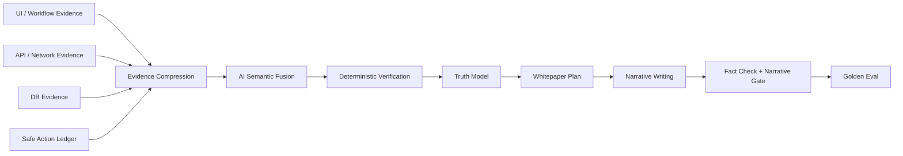

# 高真实度白皮书优化总体方案

## 目标

在没有 README、立项文档、操作手册、业务流程文档等项目资料输入的情况下，仅依赖测试环境系统本身的证据，生成业务真实度 95%+、白皮书质量 95%+ 的系统功能白皮书。

ADP 项目资料只作为 Golden Eval 标准答案，不进入生成 prompt、不进入 evidence、不作为白皮书证据来源。后续所有优化都必须证明：不喂项目资料时，流程仍能从系统取证中还原关键业务事实。

## 方法论基线

本方案不依赖单一 prompt，而采用四类成熟思路组合：

- **Task Mining / Process Mining**：从 UI 操作、接口调用、状态字段和事件线索反推业务流程。
- **GraphRAG / Truth Graph**：把模块、页面、接口、表、状态、业务对象、流程步骤建成可追溯真相图。
- **RAG Faithfulness Eval**：每条业务结论必须绑定证据引用，无证据结论降级为待确认。
- **Agent State Machine**：把 agent 限定在采集、归纳、规划、写稿、审稿等明确节点内，避免自由发挥。

## 总体架构

### 证据层

必须从系统本身采集，不依赖外部项目资料。

- `workflow-spec.json`：Stepper、弹窗、Tab、详情页、下拉、按钮可见性、流程步骤。
- `network-spec.json`：列表、详情、保存、发布、测试、监控等接口路径、请求/响应字段、状态字段。
- `state-machine.json`：状态枚举、状态含义、触发按钮、可能前后状态。
- `database-profile.json` / `entity-model.json`：测试库结构、字段、枚举、关系、脱敏样例。
- `safe-action-ledger.json`：只记录 `AI_AUTO_TEST_` 安全测试数据的写操作。

### 压缩层

脚本先把原始证据压成高信号结构，避免把 DOM、截图、日志直接丢给模型。

输出建议：

- `evidence-facts.json`：事实原子，如“AI任务管理有新建按钮”“弹窗包含定义参数/需求输出/用例执行/验收确认”。
- `candidate-workflows.json`：从 UI/API/DB 候选出的流程片段。
- `candidate-states.json`：状态枚举与触发线索。
- `candidate-business-objects.json`：业务对象候选及证据。

### AI Provider 语义融合层

AI Provider 只做结构化归纳，不直接写正文。当前实现可使用 Cursor SDK，后续可替换为 Codex、OpenAI API、私有模型或其他中转平台；方案层不绑定单一 provider。

输入：压缩证据 JSON。
输出：schema-bound JSON，所有结论必须有 evidenceRefs。

核心产物：

- `truth-candidates.json`：业务定位、对象、角色、模块职责、流程候选。
- `truth-graph.json`：节点为业务对象/模块/接口/表/状态，边为使用、驱动、生成、发布、同步、监控。
- `truth-model.json`：通过脚本校验后的业务真相模型，是写稿唯一业务输入。
- `whitepaper-plan.json`：每章必写事实、证据引用、推理边界、禁止写入项。

### 校验层

脚本负责确定性约束：

- 每条 `truth-model` 结论必须至少有一个证据引用。
- UI-only 只能证明“存在”，不能证明“完成流程”。
- API/DB/state 共同支持时，流程置信度才能提升。
- AI 输出引用不存在、引用错位、无证据推断过强时，自动降级为 `pending`。
- 写操作只有 ledger 中有 `AI_AUTO_TEST_` 数据时才能描述为已验证。

### 写稿与审稿层

AI Provider 写稿只能使用 `truth-model.json` 和 `whitepaper-plan.json`，不直接读取原始项目资料、secrets、数据库连接、全量 evidence 或源码。

写后必须通过：

- `fact-check-report.json`
- `narrative-quality-report.json`
- `truth-readiness-report.json`
- `golden-eval-report.json`（ADP 作为基准系统时启用）

## ADP Golden Eval

ADP 项目资料用于建立评测集，不作为生成输入。

建议抽取 25-40 条期望事实：

- 平台定位：保司数据对接闭环，解决产品上架最后一公里。
- 核心价值：业务提供保司接口文档，减少开发改代码，接入从约 4 天缩短到约半天。
- 主流程：定义参数 -> 需求输出 -> 用例执行 -> 验收确认 -> 发布开启 -> 定时拉保司数据 -> 写核心 -> 数据监控。
- 模块职责：AI任务管理、AI发布管理、AI数据监控/数据与运行观测、元数据管理。
- 状态流转：草稿、需求已完成、需求待生效、需求已生效。
- 外部职责边界：平台调保司、平台写核心，HiAgent 负责需求/测试类生成，不直接调保司或写核心。

评分规则：

- `covered`：白皮书或 truth-model 明确覆盖且证据链合理。
- `partial`：覆盖名词但缺少流程/职责边界。
- `missing`：完全未覆盖。
- `overclaim`：把推理写成已验证事实，或与项目资料相反。

目标：

- P0 收口：关键事实覆盖 >= 80%，overclaim = 0。
- P1 收口：关键事实覆盖 >= 90%，主流程覆盖 >= 90%。
- P2 收口：关键事实覆盖 >= 95%，状态/外部系统边界覆盖 >= 95%。

## 并行 Agent 开发模型

主 agent 是 coordinator，不直接把大任务甩给 worker。worker 只处理小而闭合的任务。

### 隔离要求

- 每个 worker 使用独立 git worktree：`.codex-worktrees/<task-id>`。
- 每个 worker 使用独立分支：`codex/<task-id>`。
- 每个 worker 有明确 `writeScope`，不得改共享大文件。
- 每个 worker 输出 handoff：`.agents/handoffs/<task-id>.md`。
- 每个 worker 使用独立测试输出目录，不共享 `outputs/adp`。
- `scripts/system-whitepaper.test.js`、`SKILL.md`、`package.json`、`.agents/4-agent-plan.json` 默认 coordinator-owned。
- 合并只能由 coordinator 做，先 review handoff、diff、测试结果，再 cherry-pick 或手工合并。

### Coordinator 职责

- 拆任务、创建 worktree、分配 writeScope。
- 每 30-60 分钟刷新进度：任务状态、阻塞点、测试结果、合并风险。
- 审查 worker 产物是否符合 schema、证据边界和安全规则。
- 统一跑全量测试、ADP golden eval、pipeline smoke。
- 统一提交，不频繁推远程。

### Worker 职责

- 只完成一个小闭环。
- 不改未授权文件。
- 不跑真实 ADP 全链路，除非任务明确要求。
- 提交 handoff：完成内容、关键文件、测试命令、风险、后续建议。

## 推荐任务拆分

### Round 0：评测基线

目标：先建立“什么叫更真实”的量化标准。

| 任务 | 产物 | writeScope | 依赖 |
| --- | --- | --- | --- |
| golden-eval-schema | `scripts/evals/*`, `docs/*eval*` | eval 脚本和文档 | 无 |
| adp-golden-facts | `examples/adp-golden-facts.json` | examples/evals | golden schema |
| eval-runner | `scripts/run-golden-eval.js` | eval 脚本 | golden facts |
| eval-tests | 单测覆盖 scoring | 测试文件由 coordinator 合并 | eval runner |

通过标准：能对当前 ADP 白皮书输出 coverage/partial/missing/overclaim 报告。

### Round 1：Workflow / API 证据

目标：从系统自身取到四步流程、弹窗、Tab、发布启停、监控证据。

| 任务 | 产物 | writeScope | 依赖 |
| --- | --- | --- | --- |
| workflow-explorer | `workflow-spec.json` 生成器 | `scripts/workflow-*` | 无 |
| network-recorder | `network-spec.json` 生成器 | `scripts/network-*` | 无 |
| state-miner | `state-machine.json` 生成器 | `scripts/state-*` | workflow/network |
| evidence-compressor | `evidence-facts.json` 汇总 | `scripts/evidence-*` | workflow/network/state |

通过标准：ADP 不用项目资料时能采到“定义参数/需求输出/用例执行/验收确认”或明确说明采不到的页面阻塞。

### Round 2：Truth Model / AI 语义融合

目标：把证据转成可写稿的业务真相模型。

| 任务 | 产物 | writeScope | 依赖 |
| --- | --- | --- | --- |
| truth-model-schema | `truth-model.schema.json` | schemas/docs | evidence facts |
| ai-fusion-node | `truth-candidates.json` | `scripts/truth-fusion-*` | schema |
| truth-verifier | `truth-model.json` 校验/降级 | `scripts/check-truth-model.js` | candidates |
| whitepaper-plan-node | `whitepaper-plan.json` | `scripts/build-whitepaper-plan.js` | truth model |

通过标准：每条业务结论都有 evidenceRefs；无引用结论不得进入 confirmed truth。

### Round 3：写稿与审稿增强

目标：让写稿严格按 truth model，不再围绕 UI 字段自由展开。

| 任务 | 产物 | writeScope | 依赖 |
| --- | --- | --- | --- |
| phase3b-plan-input | phase3b 消费 `whitepaper-plan.json` | `scripts/narrative/*` | plan node |
| semantic-reviewer | `semantic-review-report.json` | `scripts/check-semantic-*` | truth model |
| truth-readiness-integration | readiness 聚合 semantic/golden | readiness 脚本 | reviewer/eval |
| prompt-contract-tests | prompt/输出契约单测 | tests | all |

通过标准：白皮书遗漏主流程时，不能进入 review-pending。

### Round 4：ADP 回归与泛化

目标：证明不是为 ADP 硬编码。

| 任务 | 产物 | writeScope | 依赖 |
| --- | --- | --- | --- |
| adp-real-run | ADP 从头重跑报告 | outputs ignored + docs report | all |
| synthetic-system-fixtures | 通用 fixture | examples/tests | all |
| false-positive-tests | 防止把任意按钮写成流程 | tests | all |
| package-doc-update | SKILL.md / docs 收口 | coordinator-owned | all |

通过标准：ADP golden eval >= 95%，且 synthetic/negative fixtures 不误判。

## 进度管理

建议使用四类状态：

- `planned`：任务已拆分，有 writeScope。
- `running`：worker 已启动，有 worktree 和 handoff path。
- `reviewing`：worker 完成，等待 coordinator review。
- `merged`：已合并并通过相关测试。
- `blocked`：缺少环境、证据、权限或任务依赖。

每个 handoff 必须包含：

- 任务目标
- 修改文件
- 运行命令与结果
- 生成产物
- 已知风险
- 建议下一步

Coordinator 汇总进度时只报：

- 总体完成度
- 各 round 完成度
- 当前阻塞
- 下一批可并行任务
- 是否需要用户确认

## 当前优先级建议

不要先继续打磨写稿 prompt。先做：

1. **Round 0：ADP Golden Eval**
   先把“真实度差距”量化，否则后续优化没有方向。
2. **Round 1：Workflow + Network Evidence**
   这是还原真实业务流程的最高收益证据。
3. **Round 2：Truth Model Fusion**
   AI Provider 前移到结构化业务归纳，但输出必须被脚本校验。
4. **Round 3：写稿/审稿接入 truth model**
   最后再让 AI Provider 写稿。

## 不做什么

- 不把 ADP 项目资料喂给生成流程。
- 不让 AI Provider 直连数据库。
- 不让 AI Provider 自由判断 fact-check 是否通过。
- 不把原始 secrets、数据库连接、完整 DOM、截图二进制放进 prompt。
- 不在同一 worktree 里让多个 worker 同时写代码。
- 不把大而含糊的任务交给 worker。
